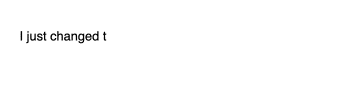

# React-Natural-Typing-Effect

## About
This is a simple and small React/Typescript component library for displaying a string's characters as Span elements within a Div element using a configurable and natural-feeling typing animation.

## Usage

In your terminal: <br/>
`npm install --save react-natural-typing-effect`

In your code:
```javascript
import Typer from "react-natural-typing-effect";

<Typer text="This text will be typed." />
```

## Props

- `text`: 
  - Type: `string`.
  - Required.
  - Default: none.
  - The string to render with a natural typing effect.

- `id`:
  - Type: `string`.
  - Optional.
  - Default: none.
  - The HTML element `id` attribute for the parent element included with this component.
  
- `isVisible`: 
  - Type: `boolean`.
  - Optional.
  - Default: `true`.
  - Whether the component is visible or not.

- `customTypingOptions`:
  - Type: `CustomTypingOptions`.
    - `{ ms: number, pow: number, ... }`.
  - Optional and all options are also optional.
  - Default: none.
  - Options:
    - `ms`
      - Type: `number`.
      - Optional.
      - Default: `20`.
      - Milliseconds.
    - `pow`
      - Type: `number`.
      - Optional.
      - Default: `2`.
      - The exponent to skew to shorter (greater exponent) or longer (smaller exponent) intervals.
    - `mode`
      - Type: `string`.
      - Optional.
      - Default: `typewriter`.
      - Built in modes are:
        - `typewriter` black text, white background, black typing head (default).
        - `negativeTypewriter` white text, black background, white typing head.
        - `blackGreenTerminal` green text, black background, solid green cursor at end of line.
    - `cursorAtEndOfLine`
      - Type: `boolean`.
      - Optional.
      - Default: `false` unless the built-in mode `blackGreenTerminal` is used.
      - Adds a cursor-like Span element at the end of the text.
      - Note: if set to `true` and mode `blackGreenTerminal` is not used then an unused CSS class name called `react-natural-typing-effect-cursor` is added to the cursor Span element. 
    - `blinkingCursor`
      - Type: `boolean`.
      - Optional.
      - Default: `false`.
      - Adds a blinking effect to the cursor. Only works if `cursorAtEndOfLine` is also `true`.
    - `isRepeated`
      - Type: `{ isRepeated: boolean, ...}`
      - Optional.
      - Default: none.
      - Specifies options for repeating the typed text. Text is not repeated if this option is unspecified.
      - Options:
        - `isRepeated`
          - Type: `boolean`.
          - Required.
          - Default: none.
          - `true` means the text is typed more than one time in an over-written manner (i.e., the text is erased and re-typed on each repeat). `false` is the same as leaving the optional parent parameter `isRepeated` unspecified: text is not repeated.
        - `count`
          - Type: `number`.
          - Required.
          - Default: none.
          - The number of times to repeat the typing of the text.
        - `isInfinite`
          - Type: `boolean`.
          - Required.
          - Default: none.
          - `true` means the text will be typed repeatedly without end (i.e., it is theoretically the same as assigning `count` to an infinite value). `false` means that the text won't be typed repeatedly infinitely.
  
- `language`
  - Type: `string | string[]`
  - Optional.
  - Default: `en` (English).
  - Specifies language code to follow for breaking down unicode code points (e.g., specify `ko` for Korean so that `라` appears to be typed as first `ㄹ` and then the `ㅏ` is added to make the final `라`).
  - Note: utilizes the Web API's `Intl` object ([https://developer.mozilla.org/en-US/docs/Web/JavaScript/Reference/Global_Objects/Intl](https://developer.mozilla.org/en-US/docs/Web/JavaScript/Reference/Global_Objects/Intl)) which accepts `string | string[]` of BCP 47 language tags ([https://datatracker.ietf.org/doc/html/rfc5646](https://datatracker.ietf.org/doc/html/rfc5646)).


## Gifs of it working

`typewriter` mode: <br/>


`negativeTypewriter` mode: <br/>


`blackGreenTerminal` mode: <br/>


